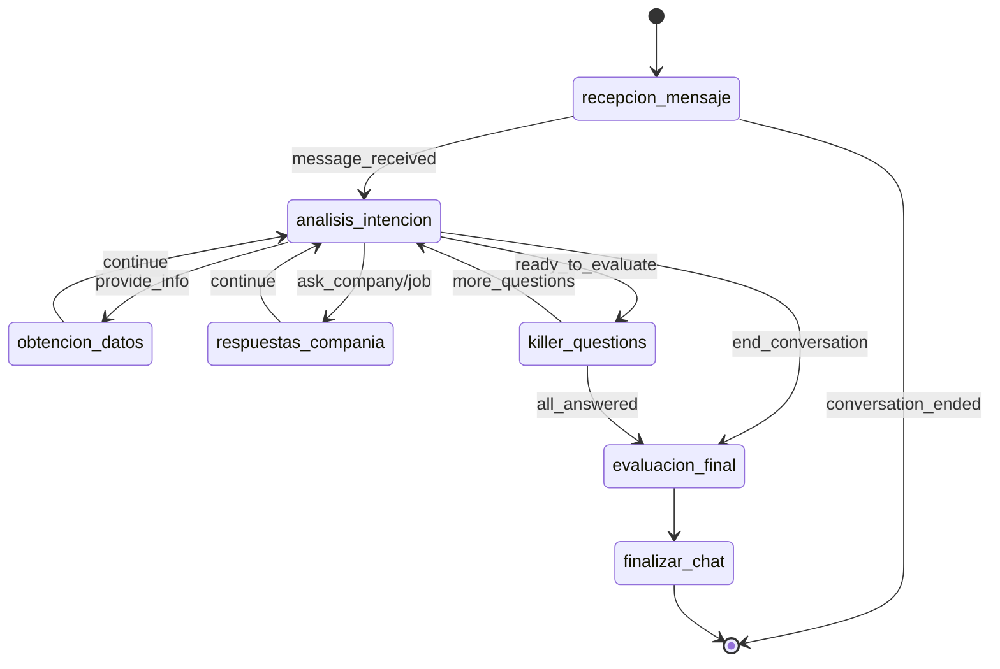

# Arquitectura del Microservicio AI Recruiter Agent

## Visión General

El **AI Recruiter Agent (AIR)** es un microservicio de nivel producción diseñado con principios de Clean Architecture, Domain-Driven Design (DDD), y estándares de código Senior A++.

## Principios de Diseño

### 1. Separación de Responsabilidades (SoC)

Cada módulo tiene una responsabilidad única y bien definida:

```
┌─────────────────────────────────────────────────────┐
│                 PRESENTATION LAYER                   │
│                   (main.py)                          │
│  - FastAPI endpoints                                 │
│  - Request/Response handling                         │
│  - Session management                                │
└─────────────────────────────────────────────────────┘
                         │
                         ▼
┌─────────────────────────────────────────────────────┐
│               ORCHESTRATION LAYER                    │
│                   (graph.py)                         │
│  - LangGraph state machine                           │
│  - Conversation flow logic                           │
│  - Node routing                                      │
└─────────────────────────────────────────────────────┘
                         │
                         ▼
┌─────────────────────────────────────────────────────┐
│                 BUSINESS LOGIC LAYER                 │
│         (services.py, llm_chain.py)                  │
│  - DataService (RAG simulation)                      │
│  - EvaluationService (scoring)                       │
│  - IntentClassificationService                       │
│  - LLMService (prompt management)                    │
└─────────────────────────────────────────────────────┘
                         │
                         ▼
┌─────────────────────────────────────────────────────┐
│                   DATA LAYER                         │
│                (data_model.py)                       │
│  - Pydantic models                                   │
│  - Type definitions                                  │
│  - Validation rules                                  │
└─────────────────────────────────────────────────────┘
```

### 2. Dependency Injection

Los servicios se inyectan en los componentes que los necesitan:

```python
class RecruiterAgent:
    def __init__(
        self,
        job_id: str,
        company_id: str,
        llm_service: Optional[LLMService] = None  # ✅ Injected
    ):
        self.llm_service = llm_service or LLMService()
        self.data_service = DataService()
```

### 3. Inmutabilidad y State Management

El estado de LangGraph es inmutable; cada nodo retorna un nuevo estado:

```python
def _analyze_intent_node(self, state: AgentState) -> AgentState:
    # No modifica el estado directamente, lo retorna modificado
    intent = self.intent_service.classify_intent(state.last_message)
    state.intent = intent
    return state  # ✅ Nuevo estado
```

## Flujo de Datos

### Request Flow

```
1. Client Request
   ↓
2. FastAPI Endpoint (main.py)
   ↓
3. Session Retrieval/Creation
   ↓
4. RecruiterAgent.process_message()
   ↓
5. LangGraph Execution
   │
   ├─→ Node: recepcion_mensaje
   │      ↓
   ├─→ Node: analisis_intencion
   │      ↓
   ├─→ Conditional Routing
   │      ↓
   ├─→ Node: killer_questions / respuestas_compania / etc.
   │      ↓
   └─→ Node: finalizar_chat
   ↓
6. Response to Client
```

### Data Flow in Graph Nodes

```python
# Ejemplo: killer_questions_node

Input: AgentState
  ├─ last_message: str
  ├─ killer_questions: List[KillerQuestion]
  └─ killer_questions_asked: List[str]
       │
       ▼
    [Node Logic]
  1. Check for unanswered questions
  2. LLMService.generate_killer_question()
  3. Update state with new question
       │
       ▼
Output: AgentState (modified)
  ├─ agent_response: str (new question)
  ├─ killer_questions_asked: List[str] (updated)
  └─ conversation_stage: "killer_questions"
```

## LangGraph State Machine

### Estados y Transiciones



### Routing Logic

La lógica de routing es determinística basada en el estado:

```python
def _route_after_intent(self, state: AgentState) -> str:
    # 1. Check for end conversation
    if state.intent == "end_conversation":
        return "evaluacion_final"
    
    # 2. Check if in killer questions stage
    if state.conversation_stage == "killer_questions":
        remaining = [q for q in state.killer_questions 
                     if q.question_id not in state.killer_questions_asked]
        return "killer_questions" if remaining else "evaluacion_final"
    
    # 3. Route by intent
    if state.intent in ["ask_company", "ask_job"]:
        return "respuestas_compania"
    
    # 4. Default flow
    return "obtencion_datos"
```

## Modelos de Datos

### Jerarquía de Modelos

```
BaseModel (Pydantic)
│
├── CandidateProfile
│   ├── candidate_id: str
│   ├── name: Optional[str]
│   ├── current_role: Optional[str]
│   ├── years_of_experience: Optional[int]
│   └── skills: List[str]
│
├── CompanyInfo
│   ├── company_name: str
│   ├── mission: str
│   ├── benefits: List[str]
│   └── ...
│
├── JobOffer
│   ├── job_id: str
│   ├── title: str
│   ├── requirements: List[str]
│   └── ...
│
├── KillerQuestion
│   ├── question_id: str
│   ├── question: str
│   ├── expected_keywords: List[str]
│   └── weight: float [0.0-1.0]
│
├── EvaluationResult
│   ├── overall_score: float [0.0-100.0]
│   ├── suitability: Literal["low", "medium", "high"]
│   └── recommendation: str
│
└── AgentState
    ├── session_id: str
    ├── current_node: str
    ├── messages: List[ConversationMessage]
    ├── candidate: Optional[CandidateProfile]
    ├── company_info: Optional[CompanyInfo]
    ├── job_offer: Optional[JobOffer]
    ├── killer_questions: List[KillerQuestion]
    ├── evaluation: Optional[EvaluationResult]
    └── conversation_ended: bool
```

### Validación de Datos

Pydantic proporciona validación automática:

```python
class KillerQuestion(BaseModel):
    weight: float = Field(
        1.0, 
        ge=0.0,  # ✅ Greater or equal to 0
        le=1.0,  # ✅ Less or equal to 1
        description="Question weight in final score"
    )
```

## Servicios

### DataService

**Responsabilidad**: Simular un sistema RAG para recuperación de datos.

```python
class DataService:
    def get_company_info(self, company_id: str) -> Optional[CompanyInfo]
    def get_job_offer(self, job_id: str) -> Optional[JobOffer]
    def get_killer_questions(self, job_id: str) -> List[KillerQuestion]
```

**En producción**, este servicio se conectaría a:
- Vector database (Pinecone, Weaviate, Chroma)
- SQL database (PostgreSQL, Cloud SQL)
- Document store (Firestore, MongoDB)

### EvaluationService

**Responsabilidad**: Evaluar candidatos basándose en sus respuestas.

```python
class EvaluationService:
    def evaluate_candidate(
        self,
        killer_questions: List[KillerQuestion],
        killer_answers: Dict[str, str]
    ) -> EvaluationResult
```

**Algoritmo de Evaluación**:

1. Para cada pregunta:
   - Contar keywords que aparecen en la respuesta
   - Calcular match_ratio = matches / total_keywords
   - Calcular score = match_ratio * weight * 100

2. Agregar scores:
   - overall_score = sum(scores) / sum(weights) * 100

3. Clasificar:
   - score >= 70: "high"
   - 40 <= score < 70: "medium"
   - score < 40: "low"

### IntentClassificationService

**Responsabilidad**: Clasificar la intención del candidato.

```python
class IntentClassificationService:
    INTENT_KEYWORDS = {
        "ask_company": ["company", "culture", "mission", ...],
        "ask_job": ["job", "role", "responsibilities", ...],
        "provide_info": ["i am", "i have", "my experience", ...],
        ...
    }
    
    def classify_intent(self, message: str) -> str
```

### LLMService

**Responsabilidad**: Gestionar todas las interacciones con el LLM.

```python
class LLMService:
    def generate_greeting(self, state: AgentState) -> str
    def generate_response(self, state: AgentState, context: str) -> str
    def generate_killer_question(self, state: AgentState, question: KillerQuestion) -> str
    def generate_evaluation_summary(self, state: AgentState) -> str
```

## Escalabilidad y Rendimiento

### Estrategias de Escalado

1. **Horizontal Scaling** (Cloud Run):
   - Auto-scaling basado en CPU/memoria
   - Max instances: configurable
   - Min instances: 0 (cost-effective)

2. **Session Management**:
   - Actual: In-memory (SessionStore)
   - Producción: Redis / Cloud Memorystore
   - Persistencia: Firestore / Cloud SQL

3. **Caching**:
   - Cache de respuestas comunes del LLM
   - Cache de datos de empresa/ofertas
   - TTL configurable

### Optimizaciones

```python
# Batch LLM calls cuando sea posible
async def process_multiple_candidates(candidates: List[str]):
    tasks = [process_candidate(c) for c in candidates]
    await asyncio.gather(*tasks)

# Connection pooling para databases
# Rate limiting para LLM API calls
# Circuit breaker para resilencia
```

## Seguridad

### Autenticación y Autorización

```python
# En producción:
from fastapi.security import HTTPBearer, HTTPAuthorizationCredentials

security = HTTPBearer()

@app.post("/api/conversation/start")
async def start_conversation(
    request: ConversationStartRequest,
    credentials: HTTPAuthorizationCredentials = Depends(security)
):
    # Verificar token
    verify_token(credentials.credentials)
```

### Secrets Management

```bash
# Google Secret Manager
gcloud secrets create gemini-api-key --data-file=key.txt

# Mount en Cloud Run
gcloud run services update ai-recruiter \
  --update-secrets GOOGLE_API_KEY=gemini-api-key:latest
```

### Input Validation

Pydantic valida todas las entradas automáticamente:

```python
class MessageRequest(BaseModel):
    session_id: str = Field(..., min_length=1, max_length=100)
    message: str = Field(..., min_length=1, max_length=5000)
```

## Observabilidad

### Logging

```python
import logging

logger = logging.getLogger(__name__)

# Structured logging
logger.info(
    f"[{node_name}] Processing - Session: {session_id}, "
    f"Stage: {stage}, Intent: {intent}"
)
```

### Métricas (Producción)

```python
# Google Cloud Monitoring
from google.cloud import monitoring_v3

# Custom metrics
- conversation_duration
- messages_per_session
- evaluation_scores
- llm_latency
```

### Tracing (Producción)

```python
# OpenTelemetry / Cloud Trace
from opentelemetry import trace

tracer = trace.get_tracer(__name__)

with tracer.start_as_current_span("process_message"):
    result = agent.process_message(state)
```

## Testing Strategy

### Pirámide de Tests

```
        ╱╲
       ╱  ╲
      ╱ E2E ╲        ← Integration tests (10%)
     ╱────────╲
    ╱          ╲
   ╱ Integration╲    ← API tests (30%)
  ╱──────────────╲
 ╱                ╲
╱   Unit Tests     ╲  ← Unit tests (60%)
────────────────────
```

### Test Coverage

- **Unit Tests**: Cada función pública
- **Integration Tests**: Flujos completos de conversación
- **Contract Tests**: Validación de esquemas API
- **Performance Tests**: Load testing con Locust

## Deployment Pipeline

```
Developer Push
      │
      ▼
GitHub Actions / Cloud Build
      │
      ├─→ Run Tests
      ├─→ Run Linters
      ├─→ Build Docker Image
      ├─→ Push to GCR
      └─→ Deploy to Cloud Run
            │
            ├─→ Staging (auto)
            └─→ Production (manual approval)
```

## Conclusión

Esta arquitectura proporciona:

✅ **Modularidad**: Componentes desacoplados y reutilizables  
✅ **Escalabilidad**: Horizontal scaling en Cloud Run  
✅ **Mantenibilidad**: Clean Code con type hints y documentación  
✅ **Testabilidad**: Dependency injection facilita mocking  
✅ **Observabilidad**: Logging estructurado y métricas  
✅ **Seguridad**: Validación de inputs y secrets management  

**Ready for production** ✨
