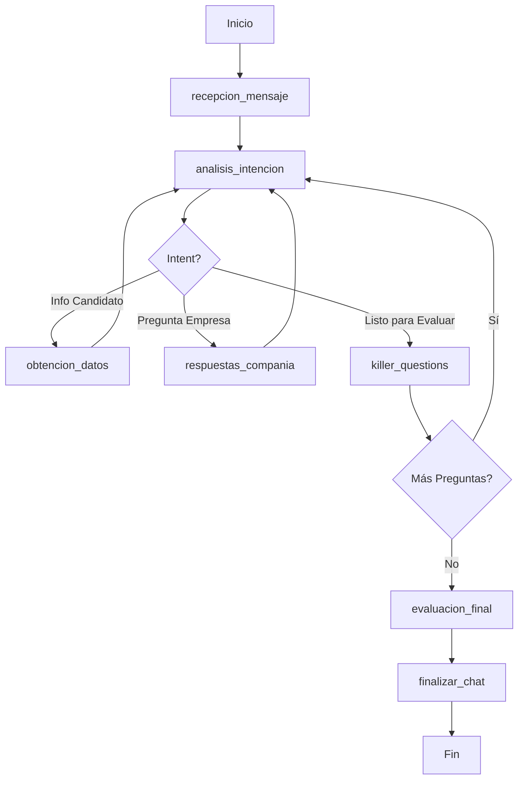

# 🤖 AI Recruiter Agent Microservice (AIR)

[](https://www.python.org/downloads/)
[](https://fastapi.tiangolo.com/)
[](https://github.com/langchain-ai/langgraph)
[](https://github.com/psf/black)

Un microservicio de agente recruiter de IA de nivel producción, construido con **Python**, **LangGraph**, y **FastAPI**, listo para despliegue en **Google Cloud Run**.

## 📋 Tabla de Contenidos

- [Características](#-características)
- [Arquitectura](#-arquitectura)
- [Instalación](#-instalación)
- [Uso](#-uso)
- [API Endpoints](#-api-endpoints)
- [Despliegue](#-despliegue)
- [Testing](#-testing)
- [Estructura del Proyecto](#-estructura-del-proyecto)
- [Estándares de Código](#-estándares-de-código)

## ✨ Características

### Funcionalidades Principales

- **🗣️ Conversaciones Autónomas**: Mantiene diálogos naturales y contextuales con candidatos
- **🔄 Flujo Orquestado con LangGraph**: State machine avanzado para gestión de conversaciones
- **📊 Evaluación Inteligente**: Sistema de "Killer Questions" con scoring automático
- **💼 RAG Integrado**: Consulta información de la compañía, ofertas de trabajo y candidatos
- **🌐 Multi-Plataforma**: Compatible con LinkedIn y Unipile
- **☁️ Cloud-Native**: Diseñado para Google Cloud Run con escalabilidad automática
- **🔒 Código de Producción**: Type hints, docstrings, manejo de errores robusto

### Estados del Grafo LangGraph

1. **recepcion_mensaje**: Recepción y preprocesamiento de mensajes
2. **analisis_intencion**: Clasificación de intención del candidato
3. **obtencion_datos**: Recopilación de información del candidato
4. **killer_questions**: Preguntas de filtrado críticas
5. **respuestas_compania**: Respuestas sobre la empresa y el rol
6. **evaluacion_final**: Scoring y evaluación del candidato
7. **finalizar_chat**: Cierre de conversación y siguiente pasos

## 🏗️ Arquitectura

```
┌─────────────────────────────────────────────────────────────┐
│                   FastAPI Microservice                      │
├─────────────────────────────────────────────────────────────┤
│  ┌──────────────┐  ┌──────────────┐  ┌──────────────┐     │
│  │   Webhook    │  │ REST API     │  │  Session     │     │
│  │   Handler    │  │  Endpoints   │  │  Management  │     │
│  └──────────────┘  └──────────────┘  └──────────────┘     │
├─────────────────────────────────────────────────────────────┤
│                    LangGraph Agent                          │
│  ┌──────────────────────────────────────────────────────┐  │
│  │  State Graph: recepcion → analisis → killer_q ...   │  │
│  └──────────────────────────────────────────────────────┘  │
├─────────────────────────────────────────────────────────────┤
│                      Services Layer                         │
│  ┌──────────────┐  ┌──────────────┐  ┌──────────────┐     │
│  │ LLM Service  │  │ Data Service │  │ Evaluation   │     │
│  │   (Gemini)   │  │    (RAG)     │  │   Service    │     │
│  └──────────────┘  └──────────────┘  └──────────────┘     │
├─────────────────────────────────────────────────────────────┤
│                     Data Models                             │
│  ┌──────────────────────────────────────────────────────┐  │
│  │  Pydantic Models: AgentState, Candidate, Job, etc.  │  │
│  └──────────────────────────────────────────────────────┘  │
└─────────────────────────────────────────────────────────────┘
```

### Componentes Principales

- **`data_model.py`**: Modelos Pydantic para type-safety y validación
- **`services.py`**: Lógica de negocio (RAG, evaluación, clasificación)
- **`llm_chain.py`**: Gestión de prompts y llamadas al LLM
- **`graph.py`**: Definición del grafo LangGraph y nodos
- **`main.py`**: Microservicio FastAPI con endpoints REST

## 🚀 Instalación

### Requisitos Previos

- Python 3.10 o superior
- pip o poetry
- (Opcional) Docker para containerización
- (Opcional) Google Cloud SDK para despliegue

### Instalación Local

```bash
# Clonar el repositorio
git clone <repository-url>
cd workspace

# Crear entorno virtual
python -m venv venv
source venv/bin/activate  # En Windows: venv\Scripts\activate

# Instalar dependencias
pip install -r requirements.txt

# Configurar variables de entorno
cp .env.example .env
# Editar .env y añadir tu GOOGLE_API_KEY
```

### Variables de Entorno

```env
GOOGLE_API_KEY=your_gemini_api_key_here
ENVIRONMENT=development
PORT=8080
```

## 💻 Uso

### Iniciar el Servidor

```bash
# Modo desarrollo
python main.py

# Con uvicorn directamente
uvicorn main:app --reload --port 8080
```

El servicio estará disponible en `http://localhost:8080`

### Ejemplo de Conversación

```bash
# 1. Iniciar conversación
curl -X POST http://localhost:8080/api/conversation/start \
  -H "Content-Type: application/json" \
  -d '{
    "candidate_id": "linkedin_12345",
    "platform": "linkedin",
    "job_id": "senior_python_dev",
    "candidate_name": "John Doe"
  }'

# Respuesta:
# {
#   "session_id": "session_abc123",
#   "message": "Hi! I'm an AI Recruiter from Tech Innovators...",
#   "status": "conversation_started"
# }

# 2. Enviar mensaje
curl -X POST http://localhost:8080/api/conversation/message \
  -H "Content-Type: application/json" \
  -d '{
    "session_id": "session_abc123",
    "message": "I have 6 years of Python experience with FastAPI and microservices"
  }'

# 3. Consultar estado de sesión
curl http://localhost:8080/api/session/session_abc123
```

### Ejemplo Programático

```python
from example_usage import simulate_conversation

# Ejecutar simulación completa de conversación
simulate_conversation()
```

## 🔌 API Endpoints

### Health Check

```http
GET /health
```

**Respuesta:**
```json
{
  "status": "healthy",
  "version": "1.0.0",
  "environment": "development",
  "timestamp": "2024-01-15T10:30:00"
}
```

### Iniciar Conversación

```http
POST /api/conversation/start
```

**Request Body:**
```json
{
  "candidate_id": "string",
  "platform": "linkedin|unipile",
  "job_id": "senior_python_dev",
  "company_id": "tech_innovators",
  "candidate_name": "string (optional)"
}
```

### Enviar Mensaje

```http
POST /api/conversation/message
```

**Request Body:**
```json
{
  "session_id": "string",
  "message": "string"
}
```

**Respuesta:**
```json
{
  "session_id": "string",
  "agent_response": "string",
  "conversation_ended": false,
  "evaluation": {
    "overall_score": 85.5,
    "suitability": "high",
    "recommendation": "string"
  }
}
```

### Webhook (LinkedIn/Unipile)

```http
POST /api/webhook
```

**Request Body:**
```json
{
  "platform": "linkedin|unipile",
  "candidate_id": "string",
  "message": "string",
  "timestamp": "ISO8601",
  "metadata": {}
}
```

### Info de Sesión

```http
GET /api/session/{session_id}
```

## ☁️ Despliegue

### Docker Local

```bash
# Construir imagen
docker build -t ai-recruiter-agent .

# Ejecutar contenedor
docker run -p 8080:8080 \
  -e GOOGLE_API_KEY=your_key_here \
  -e ENVIRONMENT=production \
  ai-recruiter-agent
```

### Google Cloud Run

```bash
# Usar script de despliegue automatizado
./deploy.sh your-project-id us-central1

# O manualmente:
# 1. Build
gcloud builds submit --tag gcr.io/your-project/ai-recruiter-agent

# 2. Deploy
gcloud run deploy ai-recruiter-agent \
  --image gcr.io/your-project/ai-recruiter-agent \
  --platform managed \
  --region us-central1 \
  --allow-unauthenticated \
  --set-env-vars GOOGLE_API_KEY=your_key
```

### Configuración de Secretos

```bash
# Crear secreto en Secret Manager
echo -n "your_api_key" | gcloud secrets create gemini-api-key --data-file=-

# Actualizar servicio para usar secreto
gcloud run services update ai-recruiter-agent \
  --update-secrets GOOGLE_API_KEY=gemini-api-key:latest
```

## 🧪 Testing

### Ejecutar Tests

```bash
# Todos los tests
pytest test_microservice.py -v

# Con coverage
pytest test_microservice.py -v --cov=. --cov-report=html

# Tests específicos
pytest test_microservice.py::TestDataModels -v
pytest test_microservice.py::TestAPIEndpoints -v
```

### Coverage Report

```bash
# Generar reporte HTML
pytest --cov=. --cov-report=html
open htmlcov/index.html
```

### Tests Incluidos

- ✅ Modelos de datos Pydantic
- ✅ Servicios (Data, Evaluation, Intent)
- ✅ Endpoints API
- ✅ Flujo completo de conversación
- ✅ Manejo de errores

## 📁 Estructura del Proyecto

```
workspace/
│
├── data_model.py           # Modelos Pydantic (AgentState, CandidateProfile, etc.)
├── services.py             # Servicios de negocio (RAG, evaluación)
├── llm_chain.py            # Configuración LLM y prompts
├── graph.py                # Definición grafo LangGraph
├── main.py                 # Microservicio FastAPI
│
├── test_microservice.py    # Suite de tests unitarios
├── example_usage.py        # Ejemplos de uso
│
├── requirements.txt        # Dependencias Python
├── Dockerfile              # Configuración Docker
├── .dockerignore          # Exclusiones Docker
├── .env.example           # Template variables de entorno
├── deploy.sh              # Script despliegue Cloud Run
│
└── README.md              # Esta documentación
```

## 📚 Estándares de Código

### Senior A++ Clean Code

Este proyecto adhiere a los más altos estándares de código:

#### ✅ Type Hinting Exhaustivo

```python
def evaluate_candidate(
    self,
    killer_questions: List[KillerQuestion],
    killer_answers: Dict[str, str]
) -> EvaluationResult:
    """Evaluación con tipos explícitos."""
```

#### ✅ Docstrings Informativos

```python
"""
Service for evaluating candidate suitability.

Analyzes candidate responses to killer questions and provides
a comprehensive evaluation with scoring.
"""
```

#### ✅ Manejo de Errores Robusto

```python
try:
    result = agent.process_message(state)
except Exception as e:
    logger.error(f"Error: {e}", exc_info=True)
    raise HTTPException(status_code=500, detail=str(e))
```

#### ✅ Modularidad y Separación de Responsabilidades

- Modelos de datos separados (`data_model.py`)
- Lógica de negocio en servicios (`services.py`)
- Orquestación en grafo (`graph.py`)
- API en capa de presentación (`main.py`)

#### ✅ Diseño Orientado a Objetos

```python
class RecruiterAgent:
    """Clean OOP design con métodos bien definidos."""
    
    def __init__(self, job_id: str, company_id: str):
        self.data_service = DataService()
        self.evaluation_service = EvaluationService()
```

## 🔄 Flujo de Conversación



## 🤝 Contribución

Este es un proyecto de producción. Para contribuir:

1. Mantén los estándares de código A++
2. Añade tests para nueva funcionalidad
3. Actualiza documentación
4. Ejecuta linters: `black .` y `flake8`
5. Asegura coverage > 80%

## 📄 Licencia

Copyright © 2024. Todos los derechos reservados.

## 🙋 Soporte

Para preguntas o soporte:
- Documentación: Este README
- Ejemplos: `example_usage.py`
- Tests: `test_microservice.py`

---

**Construido con ❤️ usando Python, LangGraph, y FastAPI**

*Ready for production deployment on Google Cloud Run* ☁️
